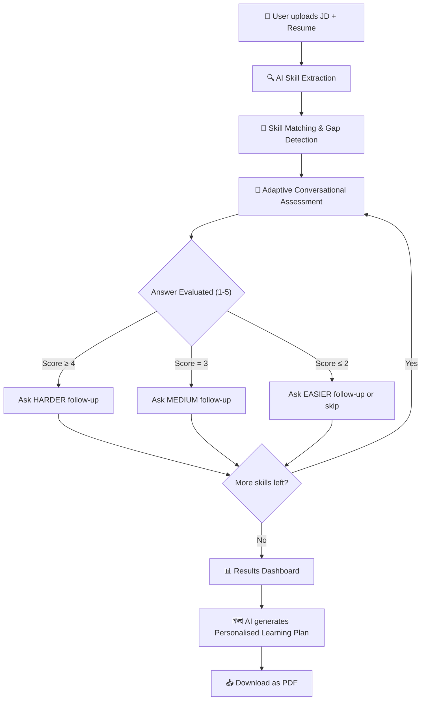

# ⚡ SkillProbe AI — AI-Powered Skill Assessment & Personalised Learning Plan Agent

> **Catalyst Hackathon by Deccan AI**

🔗 **Live Demo:** [https://skillprobe-ai.onrender.com](https://skillprobe-ai.onrender.com)


> ⏳ **Note:** The app is hosted on Render's free tier. If the site hasn't been visited recently, it may take **30–60 seconds to wake up** on the first load. Please be patient — once it's up, it runs smoothly!

---

## 📌 Problem Statement

> *"A resume tells you what someone claims to know — not how well they actually know it."*

Build an agent that takes a **Job Description** and a **Candidate's Resume**, conversationally assesses real proficiency on each required skill, identifies gaps, and generates a **personalised learning plan** focused on adjacent skills the candidate can realistically acquire — with curated resources and time estimates.

---

## 🎯 What SkillProbe AI Does

SkillProbe AI is a full-stack, AI-powered conversational assessment agent that goes far beyond keyword matching. It takes a Job Description and a Resume, dynamically extracts and matches skills, conducts a **real-time adaptive interview** via a chat interface, scores the candidate's actual proficiency, and generates a **personalised learning roadmap** — downloadable as a professional **PDF document**.

### ✨ Key Features

| Feature | Description |
|---|---|
| 📄 **Smart Document Parsing** | Upload a Resume PDF or paste text alongside a Job Description. The AI extracts skills, categorises them by importance, and identifies gaps automatically. |
| 💬 **Conversational Assessment** | An adaptive chat interface powered by Llama-3.3-70b (via Groq). The AI asks practical questions, adjusts difficulty based on answers, and provides instant feedback. |
| 📊 **Gap Analysis Dashboard** | A visual results screen with a circular readiness score, per-skill proficiency ratings (1-5), and level labels (Novice → Expert). |
| 🗺️ **Personalised Learning Plan** | AI generates a full learning roadmap: prioritised skills to learn, curated resource URLs, weekly time estimates, and milestone tracking — all based on adjacent skills the candidate already knows. |
| 📥 **PDF Export** | Download the entire personalised learning plan as a professionally formatted PDF document, ready to share. |

---

## 🛠️ Tech Stack

| Layer | Technology |
|---|---|
| **Backend** | Python 3.14, FastAPI |
| **Frontend** | Vanilla HTML5, CSS3 (Aurora Noir theme), JavaScript |
| **AI Model** | Groq (`llama-3.3-70b-versatile`) via OpenAI-compatible SDK |
| **PDF Generation** | fpdf2 |
| **Resume Parsing** | PyMuPDF (fitz) |
| **Validation** | Pydantic v2 |
| **Deployment** | Render |

---

## 🧠 How It Works — End-to-End Flow



### Detailed Stage Breakdown

#### Stage 1: Document Upload & Skill Extraction
- User provides a **Job Description** (text) and a **Resume** (PDF upload or pasted text).
- The AI (Llama-3.3-70b) analyses both documents and extracts:
  - **Required Skills** from the JD, ranked by importance (`critical`, `important`, `nice-to-have`).
  - **Candidate Skills** from the resume, with claimed experience and context.
  - **Initial Gaps** — skills required by the JD but missing, weak, or partial in the resume.

#### Stage 2: Adaptive Conversational Assessment
- The AI assesses each required skill through a dynamic chat conversation.
- **Adaptive Difficulty:**
  - If the skill appears in the resume → starts at `medium` difficulty.
  - If the skill is missing → starts at `easy` difficulty.
  - After each answer, the AI evaluates and adjusts:
    - Score ≥ 4 → next question is `hard`
    - Score ≤ 2 → next question is `easy` (or skips if score = 1)
    - Score = 3 → next question stays `medium`
- Each skill gets up to **3 questions** maximum.
- The AI provides instant feedback with a score, strengths, and weaknesses after each answer.

#### Stage 3: Scoring & Results
Each answer is scored on a 1–5 rubric:

| Score | Level | Meaning |
|---|---|---|
| 1 | Novice | Cannot explain the concept |
| 2 | Beginner | Textbook knowledge only, no practical experience |
| 3 | Intermediate | Can solve standard problems with some guidance |
| 4 | Advanced | Deep understanding, handles edge cases |
| 5 | Expert | Can architect solutions and teach others |

The final score per skill is a **weighted average**, giving more weight to harder follow-up questions.

#### Stage 4: Learning Plan Generation
- The AI generates a **personalised learning roadmap** based on:
  - Skills scored 1–3 (gaps), prioritised by job importance.
  - **Adjacent skill mapping** — leveraging what the candidate already knows to accelerate learning (e.g., "You know Django, so learning FastAPI will be faster since you already understand ORM patterns and routing").
- Each learning item includes:
  - Current level → Target level progression
  - Priority ranking (high / medium / low)
  - **Curated resource URLs** (courses, docs, tutorials, videos)
  - Estimated weeks and hours
  - Concrete milestones

#### Stage 5: PDF Export
- The user can instantly download the entire learning plan as a professional, multi-page PDF document.

---

## 🏗️ Project Architecture

```
skill-assessment-agent/
├── main.py                    # FastAPI entry point, routing, static files
├── requirements.txt           # Python dependencies
├── .env                       # Environment variables (GROQ_API_KEY)
├── .gitignore
├── README.md
├── ARCHITECTURE.md            # Detailed architecture & logic docs
│
├── app/
│   ├── __init__.py
│   ├── config.py              # Settings (API keys, model config)
│   ├── models.py              # Pydantic models for all data structures
│   │
│   ├── services/
│   │   ├── ai_service.py      # Groq/OpenAI API wrapper with JSON mode
│   │   ├── resume_parser.py   # PDF text extraction using PyMuPDF
│   │   ├── skill_extractor.py # AI-powered skill extraction from JD + Resume
│   │   ├── assessment.py      # Core assessment engine (session management,
│   │   │                      #   adaptive questioning, scoring)
│   │   └── learning_plan.py   # AI-powered learning plan generator
│   │
│   ├── prompts/
│   │   └── templates.py       # All AI prompt templates (extraction,
│   │                          #   questioning, evaluation, plan generation)
│   │
│   └── routes/
│       ├── upload.py          # POST /api/upload — document upload & parsing
│       ├── assess.py          # POST /api/assess/start, /api/assess/answer
│       └── plan.py            # POST /api/plan/generate,
│                              #   GET /api/plan/export-pdf/{session_id}
│
├── static/
│   ├── css/
│   │   └── style.css          # Aurora Noir theme (glassmorphism, gradients)
│   └── js/
│       └── app.js             # Frontend logic (SPA navigation, chat UI,
│                              #   API integration, PDF download)
│
├── templates/
│   └── index.html             # Single-page HTML shell
│
└── sample_data/               # Example JDs and Resumes for testing
```

---

## 🔌 API Endpoints

| Method | Endpoint | Description |
|---|---|---|
| `GET` | `/` | Serves the frontend SPA |
| `POST` | `/api/upload` | Upload JD + Resume, returns extracted skills |
| `POST` | `/api/assess/start?session_id=` | Starts the conversational assessment |
| `POST` | `/api/assess/answer` | Submit an answer, receive evaluation + next question |
| `GET` | `/api/assess/{session_id}` | Get full assessment results |
| `POST` | `/api/plan/generate` | Generate the personalised learning plan |
| `GET` | `/api/plan/export-pdf/{session_id}` | Download learning plan as PDF |

---

## 🚀 Setup Instructions

### Prerequisites
- Python 3.9+
- A **Groq API Key** (free, no credit card needed)
  → Get one at [console.groq.com](https://console.groq.com)

### 1. Clone the Repository
```bash
git clone https://github.com/your-username/skillprobe-ai.git
cd skillprobe-ai
```

### 2. Create a Virtual Environment
```bash
python -m venv venv
source venv/bin/activate  # On Windows: venv\Scripts\activate
```

### 3. Install Dependencies
```bash
pip install -r requirements.txt
```

### 4. Configure Environment Variables
Create a `.env` file in the project root:
```env
GROQ_API_KEY=gsk_your_groq_api_key_here
```

### 5. Run the Application
```bash
python main.py
```
Open your browser and navigate to: **http://localhost:8000**

---

## 🎬 Demo Video
*(Add your demo video link here)*

---

## 👤 Author
**Praveen B**
Built for the Catalyst Hackathon by Deccan AI
